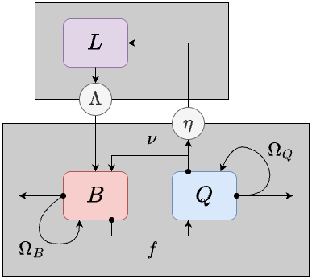
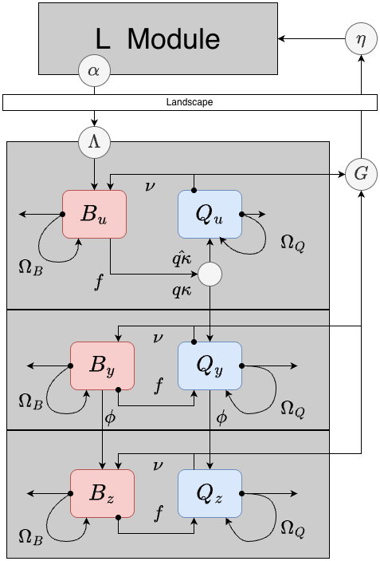

```{r, message=FALSE, warning=FALSE, echo=F} 
library(knitr)
library(ramp.xds)
library(deSolve) 
library(ramp.library)
```

Here, we describe two closely-related modules for the adult mosquito component, called **BQm** (Figure 1) and **BQ** (Figure 2). Both are implemented as systems of ordinary differential equations.  

+ The **BQ** module is based on a behavioral state model for mosquito ecology and infection dynamics: it has both **M** and **Y** components. 

```
MYname = "BQ" 
```

+ The **BQm** module lacks parasite infection dynamics: it has the **M** component but lacks the **Y** component, so it should be used only with `xds_setup_mosy()`. 

```
Mname = "BQm" 
```

**BQm** is simpler than **BQ,** and the two modules are equivalent when $\kappa=0$ and the initial conditions for **BQ** do not include any infected mosquitoes.

In this vignette, we explain behavioral state dynamics first (**BQm**). Next, then we extend the model to include infection dynamics (**BQ**).  


# Mosquito Behavioral State Dynamics

Most of the models developed to model malaria parasite infections in mosquitoes look at the *infection states:* for example, uninfected; infected but not infectious; or infected and infectious. A different class of models tracks the behavioral / physiological state of mosquitoes, so we call them *behavioral state models.* A model with both *infection states* and *behavioral states* was first published by   Le Menach, *et al.* (2005)^[Menach AL, *et al.* The unexpected importance of mosquito oviposition behaviour for malaria: non-productive larval habitats can be sources for malaria transmission. Malar J 4, 23 (2005). https://doi.org/10.1186/1475-2875-4-23]. 

In behavioral state models for mosquito ecology, we assume that a mosquitoes is in a physiological state that is accompanied by a set of behavioral algorithms: in these two modules, a mosquito is either trying to *blood feed* or *lay eggs.* These models are thus ignored *mating,* *sugar feeding,* and post-prandial *resting.* (Other modules have been developed to model these conditions.) 

## Variables 

Two state variables in **BQm** describe the density of mosquitoes:  

+ $B$ - the population density mosquitoes in a blood feeding state 

+ $Q$ - the population density of mosqutioes in an egg laying state 

## Bionomic Parameters

These equations are defined for patch-based models with $p$ patches. We thus assume that all the parameters, variables, and terms are of length $p$ except for $\Omega_b$ and $\Omega_q$, which are $p \times p$ matrices. 

Two parameters describe the behavioral state transitions:  

+ $f$ - the blood feeding rate(s) 

+ $\nu$ - the egg laying rate(s) 

In these models, patterns can emerge as mosquitoes respond to the availability of resources. Both parameters are thus implemented as *ports:* the default implementation is a model with no forcing, but the parameters could also be a function of resource availability, weather, or something else. In these models, the parameters affecting mosquito survival and dispersal. To compute these, we formulate demographic matrices for each behavioral state that are, potentially, site-specific: $\Omega_b$ and $\Omega_q.$ 

**The Demographic Matrices** 

+ $g_b, g_q$ - the mosquito per-capita death rates while in each behavioral state

+ $\sigma_b, \sigma_q$ - behavioral state-specific patch emigration rates for blood-feeding or egg-laying mosquitoes

+ $\mu_b, \mu_q$ - behavioral state-specific emigration loss rate: excess mortality associated with migration 

+ $K_b, K_q$ - are  **Dipsersal Matrices** - Each one of the following parameters can take on a unique value in each patch.  Each dispersal matrix has the form:
$$K = \left[
\begin{array}{ccccl}
0 & k_{1,2} & k_{1,3} & \ldots & k_{1,p} \\ 
k_{2,1} & 0 & k_{2,3} &  \ldots & k_{2,p} \\ 
k_{3,1} & k_{3,2} & 0 &  \ldots & k_{3,p} \\ 
\vdots& \vdots &\vdots & \ddots & \vdots \\
k_{p,1} & k_{p,2} & k_{p,3} &  \ldots & 0 \\ 
\end{array}
\right].$$
The diagonal elements are all $0$, and other elements, $k_{i,j} \in {K}$, are the fraction of blood feeding mosquitoes leaving patch $j$ that end up in patch $i$; the notation should be read as $i \leftarrow j$, or *to $i$ from $j$*. Notably, the form of $K$ is constrained such that $$\sum_i k_{i,j} = 1.$$ 

+ $\Omega_b$ is the demographic matrix for blood feeding mosquitoes: 
$$\Omega_b = \mbox{diag}\left(g_b\right) - \mbox{diag}\left(\sigma_b\right) \left(\mbox{diag}\left(1-\mu_b\right) - K_b \right)$$

+ $\Omega_q$ is the demographic matrix for egg laying mosquitoes: 
$$\Omega_q = \mbox{diag}\left(g_q\right) - \mbox{diag}\left(\sigma_q\right) \left(\mbox{diag}\left(1-\mu_q\right) - K_q \right)$$

## Dynamics 
 
The emergence rate of adult mosquitoes is denoted $\Lambda,$ which is computed in the **L** Component. Here, we assume that all emerging mosquitoes are added to the blood feeding population. (For mosquito biologists, these modules thus lack the skill to model *autogeny*.) 

We can now define the dynamical system as a system of coupled ordinary differential equations: 

\begin{array}{rl}
\dfrac{dB}{dt} &= \Lambda  + \nu Q - f B - \Omega_b \cdot B \\
\dfrac{dQ}{dt} &= f B - \nu Q  - \Omega_q \cdot Q 
\end{array}

***


***

# Infection Dynamics 

There are three mutually exclusive and collectively exhaustive infection states: *uninfected,*  *infected but not yet infectious,* and *infected and infectious.* 

In extending the model to include infection states, we must define two additional parameters: 

+ $q$ - the human blood feeding fraction 

+ $\phi$ - the rate that infected mosquitoes become infective (it is inverse of the EIP) 

In addition, the dynamical term $\kappa,$ passed from the transmission module, is net infectiousness: the probability a mosquito becomes infected after blood feeding on a human.  


## Variables

 The infection states are orthogonol to the behavioral states, so each behavioral state is replicated for each infection state, yielding $6p$ variables: 

+ $B_u$ - uninfected, blood feeding mosquitoes

+ $Q_u$ - uninfected, egg laying mosquitoes

+ $B_y$ - infected but not infective, blood feeding mosquitoes

+ $Q_y$ - infected but not infective, egg laying mosquitoes

+ $B_z$ - infective, blood feeding mosquitoes

+ $Q_z$ - infective, egg laying mosquitoes

## Dynamics 

Behavioral state transitions proceed as in the model lacking infected states. Infected states affect two other state transitions: 

+ Mosquitoes emerge uninfected and blood feeding.  

+ A fraction $q\kappa$ of uninfected, blood feeding mosquitoes become infected and transition from $B_u$ to $Q_y$ (instead of $Q_u$)

+ Mosquitoes in both $y$ states transition to $z$ states at the rate $\phi$ 

$$
\begin{array}{rl}
\dfrac{dB_u}{dt} &= \Lambda  + \nu Q_u - f B_u - \Omega_b \cdot B_u \\
\dfrac{dQ_u}{dt} &= f (1- q \kappa) B_u - \nu Q_u  - \Omega_q \cdot Q_u \\
\dfrac{dB_y}{dt} &= \nu Q_y - (f+\phi) B_y - \Omega_b \cdot B_y \\
\dfrac{dQ_y}{dt} &= f q \kappa B_u + f B_y - (\nu + \phi) Q_y - \Omega_q \cdot Q_y  \\
\dfrac{dB_z}{dt} &= \phi B_y + \nu Q_z - f B_z - \Omega_b \cdot B_z \\
\dfrac{dQ_z}{dt} &= \phi Q_y + f B_z  - \nu Q_z  - \Omega_q \cdot Q_z 
\end{array}
$$


***


***

# Examples 

The `xds_setup()` utilities allow the user to pass a single version of the dispersal matrix `K_matrix.`  During `xds_setup()`, `Omega_b` and `Omega_q` are identical.  


```{r}
HPop = rep(1000, 3)
residence = c(1:3) 
model <- xds_setup(MYname="RMG", Lname="trivial", Xname = "trivial",  residence=residence, HPop =HPop, nPatches=3)
```

```{r}
model <- xds_solve(model)
```

```{r, fig.height=4, fig.width=5.5}
xds_plot_M(model)
xds_plot_Y(model, add = T)
xds_plot_Z(model, add = T)
```

```{r, fig.height=4, fig.width=5.5}
xds_plot_Y_fracs(model)
xds_plot_Z_fracs(model, add=T)
```


