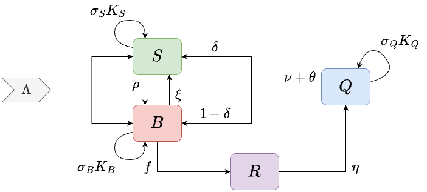

```
MYname = "BRQS"
``` 

For the **MY** component, the **BRQS** module implements a behavioral state model for mosquito ecology and infection dynamics with two orgthogonal state spaces: 

+ The *behavioral states* are blood feeding ($B$), post-prandial resting ($R$), egg laying ($Q$) and sugar feeding ($S$);

+ The *infection states* are uninfected ($u$), infected ($y$), and infectious ($z$); 

+ The full model thus has 12 variables per patch: 3 for blood feeding, ($B_u,$ $B_y,$ and $B_z$); 3 for resting ($R_u$, $R_y,$ and $R_z$); 3 for egg laying ($Q_u,$ $Q_y,$ and $Q_z$); and 3 for sugar feeding ($S_u$, $S_y$, and $S_z$).

+ Mosquitoes move from $B_u$ to $R_y$  when they blood feed on an infectious human (at the rate $fq\kappa$, see below)  

+ Mosquitoes in all $y$ states move to $z$ states at the rate $\phi,$ where $\phi^{-1}$ is the EIP.

This vignette describes the model and its implementation in `ramp.library.` 

***



*** 

# Basic Dynamics  

## Behavioral State Dynamics: A Compartment Model

In the basic compartmental model, there are four behavioral states: 

+ $B$ the density of blood feeding mosquitoes; 

+ $R$ the density of resting mosquitoes; 

+ $Q$ the density of egg laying mosquitoes.

+ $S$ the density of sugar feeding mosquitoes; 

Mosquitoes emerge from aquatic habitat at the patch-specific rate $\Lambda,$ and  

## Parameters

+ $f$ is the overall blood feeding rate; the inverse $f^{-1}$ describes the average time to blood feed after entering the blood feeding state

+ $\nu$ is the egg laying rate; 

+ $\delta$ is the fraction of mosquitoes that transition into a sugar feeding state after laying eggs; the remaining $1-\delta$ transition into a blood feeding state. In some models, we let $\delta$ be a function of the local availability of sugar.  

+ $\zeta$ is rate that blood feeding mosquitoes switch to sugar feeding 

+ $\theta$ is rate gravid mosquitoes resorb their eggs, reverting to a blood feeding state; while we do not explicitly model opportunistic sugar feeding while laying eggs, we assume mosquitoes would remain in the egg laying state if sugar was readily available, so $\theta$ could be described using a functional response to available sugar 

+ $\Omega_x$ is a state-specific dispersal matrix: 

    - $g_x$ is the state-specific mortality rate

    - $\sigma_x$ is the state-specific emigration rate, 
    
    - $\mu_x$ is state-specific survival associated with 
    
    - $K_x$ the state-specific dispersal matrix; 
    
    - The demographic matrix is $$\Omega_x = g_x + \sigma_x(\mu_x- K_x)$$

+ $\xi$ is the refeeding rate 


+ $\eta^{-1}$ is the duration of the post-prandial resting period 


$$
\begin{array}{rl}
\dot B &= \Lambda + \rho S + (\nu \delta + \theta) Q + \xi R - (f + \zeta_B) B - \Omega_B \cdot B \\
\dot S &= \Lambda + \nu (1-\delta) Q + \zeta B  - \rho S - \Omega_S \cdot S \\  
\dot R &= f B - (\xi + \eta + g) R \\ 
\dot Q &= \eta R - (\nu + \theta) Q - \Omega_Q \cdot Q \\
\end{array}
$$

In this version, mosquitoes switch back into a blood feeding state after laying eggs. A parameter $\zeta$ determines whether the mosquitoes would switch into a sugar feeding state from either a blood feeding or egg laying state. 

Note that since all sugar feeding mosquitoes transition into a blood feeding state, the transition into sugar feeding from egg laying implies the eggs have been reabsorbed. 

## Infection Dynamics

**Variables** 

+ Each one of the behavioral states is replicated for each one of the infection states. The variable names add a subscript $u$ for uninfected; $y$ for infected but not yet infectious; and $z$ for infectious:

+ $S_u$, $S_y$, and $S_z$ are the density of uninfected, infected but not infectious, and infectious sugar feeding mosquitoes. 

+ $B_u$, $B_y$, and $B_z$ are the density of uninfected, infected but not infectious, and infectious blood feeding mosquitoes. 

+ $R_u$, $R_y$, and $R_z$ are the density of uninfected, infected but not infectious, and infectious resting mosquitoes. 

+ $Q_u$, $Q_y$, and $Q_z$ are the density of uninfected, infected but not infectious, and infectious egg laying mosquitoes. 

**Terms** 

$\kappa$ is the NI, the probability of becoming infected after blood feeding on a human 

**Parameters** 

+ $\phi^{-1}$ is the EIP

+ $q$ is the human fraction for blood feeding


We present the following behavioral state model:

**uninfected** 

$$
\begin{array}{rl}
\dot S_u &= \Lambda + \zeta B_u + \nu (1-\delta) Q_u - \rho S_u - \Omega_S \cdot S_u \\  
\dot B_u &= \rho S_u + (\nu \delta+ \theta) Q_u + \xi R - (f + \zeta) B_u - \Omega_B \cdot B_u \\
\dot R_u &= f (1-q\kappa) B_u - (\xi + \eta + g) R_u \\ 
\dot Q_u &= \eta R_u - (\nu + \theta) Q_u- \Omega_Q \cdot Q_u
\end{array}
$$
**infected** 

$$
\begin{array}{rl}
\dot S_y &= \zeta B_y + \nu (1-\delta) Q_y - \rho S_y - \Omega_S \cdot S_y -\phi S_y\\  
\dot B_y &= \rho S_y + (\nu \delta + \theta) Q_y + \xi R - (f + \zeta) B_y - \Omega_B \cdot B_y -\phi B_y\\
\dot R_y &= f q \kappa B_u + f B_y- (\xi + \eta + g) R_y - \phi R_y\\ 
\dot Q_y &= \eta R_y - (\nu + \zeta) Q_y- \Omega_Q \cdot Q_y - \phi Q_y
\end{array}
$$

**infectious** 

$$
\begin{array}{rl}
\dot S_z &= \phi S_y + \zeta B_z + \nu (1-\delta) Q_z  - \rho S_z - \Omega_S \cdot S_z \\  
\dot B_z &= \phi B_y + (\nu \delta + \theta) Q_z + \rho S_z + \xi R - (f + \zeta) B_z - \Omega_B \cdot B_z \\
\dot R_z &= \phi R_y + f B_z - (\xi + \eta + g) R_z \\ 
\dot Q_z &= \phi Q_y + \eta R_z - (\nu + \theta) Q_z- \Omega_Q \cdot Q_z
\end{array}
$$
