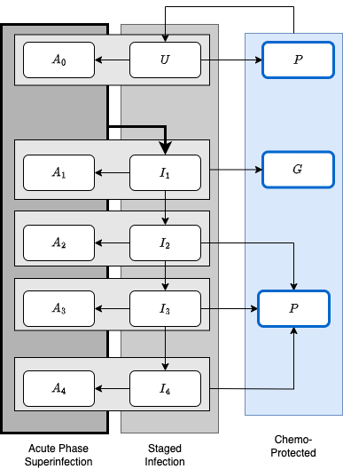

```{r}
library(ramp.xde)
library(deSolve)
library(ramp.library)
#devtools::load_all()
```

#   

**Warning:** `workhorse` is in development. 

In the following, we present a stage of infection (SoI) model for malaria infection that recognizes an important difference between the two major phases of an infection: the acute phase characterized by geometrically increasing parasite numbers; and the chronic phase characterized by fluctuating parasite densities. The model explicitly considers *superinfection,*  which moves individuals from an infected state into a parallel set of states.  

+ Uninfected individuals are either susceptible to infection $U$ or chemoprotected and not susceptible to infection. 

+ Some recently treated, chemoprotected individuals remain infections $G.$ The remainder are chemoprotected and not infectious, $P.$

+ There are four chronic infection stages.

+ There are five acute infection stages: four that correspond to an acute-phase infection concurrently infected with parasites in the chronic phase; and one that corresponds to carrying an acute phase infection but being otherwise uninfected. 

+ All acutely infected individuals transition into $I_1$  



## Variables

The variables are thus:

+ $U$ 

+ Chemoprotected states are $P$ and $G$ 


Active acute-phase infections become apparent after $\tau$ days, and:

**Uninfected** 

$$
\begin{array}{rl}
\frac{dU}{da} &= r \sum_i I_i + \sigma (P + G) - (h_\tau + \zeta_U) U \\
\frac{dA_0}{da} &= r \sum_i A_i + h_\tau U - (\phi + \zeta_A + \zeta_U) A_0 
\end{array}
$$
**Chemoprotected** 

We are assuming that treatment as a result of an acute infection could leave a person infectious: 

$$
\begin{array}{rl}
\frac{dP}{da} &= \zeta_U (U + A_0) + \sum_{i\geq 2} \zeta_i I_i  - \sigma P  \\
\frac{dG}{da} &= \zeta_1 I_1 + \zeta_A \sum_i A_i  - \sigma G  \\
\end{array}
$$

**Infected** 

Where $\phi$ is on the order of $1/10 d$ and 

At peak:

$$
\begin{array}{rl}
\frac{dI_1}{da} & = p(w) \phi \sum_i A_i -  (h_\tau + r + \xi_1 + \zeta_1) I_1 \\
\frac{dI_2}{da} & = (1-p(w)) \phi \sum_i A_i + \xi_1 I_1 -  (h_\tau + r + \xi_2+ \zeta_2) I_2 \\
\frac{dI_3}{da} & = \xi_2 I_2 -  (h_\tau + r + \xi_3 + \zeta_3) I_3 \\
\frac{dI_4}{da} & = \xi_3 I_3 -  (h_\tau + r + \zeta_4) I_4 \\
\end{array}
$$

Past peak, for $n \in 2,3,4$:

$$
\begin{array}{rl}
\frac{dA_1}{da} & =  h_\tau I_1 - \phi A_1 - (\zeta_A + r + \zeta_1) A_1 \\
\frac{d A_n}{da} &=  h_\tau I_n - \phi A_n - (\zeta_A + \zeta_n) I_n\\
\end{array}
$$
**Immune Tracking**

$$
\begin{array}{rl}
\frac{d w_0}{da} &=  h_\tau \\ 
\frac{d w_i}{da} &=  h_\tau - \delta_I w_i \\
\end{array}
$$ 


```{r}
wh <- xde_setup(Xname = "workhorse", HPop=1000, Lopts = list(Lambda = 3000, Lt = function(t){1+sin(2*pi*t/365)}))
class(wh$xde) <- "dde"
```

```{r}
wh <- xde_solve(wh, Tmax = 5*365, dt=10)
```

```{r}
wh1 = wh 
wh1$Xpar[[1]]$zeta_1 = 0.02
wh1 <- xde_solve(wh1, Tmax = 5*365, dt=10)
```

```{r}
xds_plot_X(wh)
xds_plot_X(wh1, llty=2, add_axes=FALSE)
```

```{r}
with(wh$outputs$orbits$XH[[1]],{
  A = A0+A1+A2+A3+A4
  I = I1+I2+I3+I4
  plot(time, U + P + G, type = "l", ylim = range(0, H), col = "darkblue") 
  lines(time, A+I, col = "darkred") 
  lines(time, A, col = "purple") 
  lines(time, I-I1, col = "orange") 
  lines(time, P+G, col = "darkgreen") 
})

with(wh1$outputs$orbits$XH[[1]],{
  A = A0+A1+A2+A3+A4
  I = I1+I2+I3+I4
  lines(time, U + P + G, col = "darkblue", lty=2) 
  lines(time, A+I, col = "darkred", lty=2) 
  lines(time, A, col = "purple", lty=2) 
  lines(time, I-I1, col = "orange", lty=2) 
  lines(time, P+G, col = "darkgreen", lty=2) 
})
```


